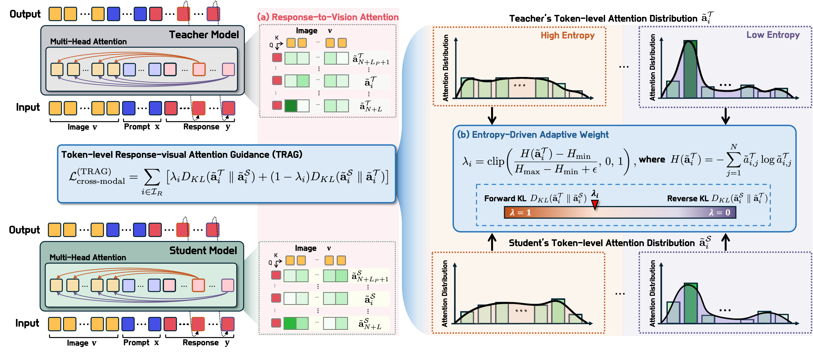

# 🌟 TRAG: Token-level Response-visual Attention Guidance for Multimodal LLMs Knowledge Distillation
<p align="center">
  <b>ECCV 2026</b>
</p>

<p align="center">
  <a href="https://arxiv.org/abs/XXXX.XXXXX">
    
  </a>
  <a href="#-citation">
    
  </a>
</p>

<p align="center">
  🚧 This repository is currently under preparation. 🚧
</p>

## 📢 News

- **[2026.XX]** TRAG was accepted to **ECCV 2026**.
- **[2026.XX]** Repository created. Code and reproduction instructions will be released soon.

## 📌 Overview

This is the official repository for:

**Token-level Response-visual Attention Guidance for Multimodal LLMs Knowledge Distillation**

TRAG is a knowledge distillation framework for Multimodal Large Language Models (MLLMs).  
The core idea is to guide a compact student model by supervising **Response-to-Vision attention**, which reflects how visual evidence is used during response generation.

Rather than relying only on output token distributions, TRAG focuses on the visual grounding behavior that emerges while the model generates each response token.

## 🔍 Key Idea

TRAG is built around two observations:

1. **Response-to-Vision attention is more informative than Prompt-to-Vision attention**  
   Visual grounding during response generation is closely related to downstream performance.

2. **Different response tokens require different visual grounding behavior**  
   Some tokens attend broadly to the scene, while others require more localized visual evidence.

Based on these observations, TRAG introduces a token-level attention guidance objective for MLLM distillation.

## 🧠 Method Highlights

- 🖼️ **Response-to-Vision Attention Guidance**  
  TRAG supervises attention from response tokens to visual tokens.

- 🔎 **Token-level Distillation**  
  Each response token is guided separately, enabling fine-grained visual grounding transfer.

- ⚖️ **Entropy-aware Adaptive KL Objective**  
  TRAG adaptively balances forward KL and reverse KL based on the teacher's attention entropy.

- 📉 **Compact MLLM Distillation**  
  TRAG is designed to improve lightweight MLLMs by transferring visual grounding behavior from a larger teacher model.

## 🖼️ Method Overview

<p align="center">
  
</p>

<p align="center">
  <i>Overview of Token-level Response-visual Attention Guidance.</i>
</p>

## 📂 Repository Status

The repository is currently being prepared.

Planned release:

- [ ] Training code
- [ ] Evaluation scripts
- [ ] Attention extraction utilities
- [ ] Configuration files
- [ ] Reproduction instructions

More details will be added soon.

## 🧪 Results

Experimental results and reproduction details will be added after the code release.

## 📖 Citation

If you find this work useful, please consider citing:

```bibtex

````

## 📬 Contact

For questions, please contact: [jhjangjh@kaist.ac.kr](mailto:jhjangjh@kaist.ac.kr)
